# 📘 Enroll-Mate

**Enroll-Mate** is a Spring MVC web application designed to manage student-course enrollment. It provides an intuitive UI to perform CRUD operations on students and courses, and view their relationships.

---

## 🛠️ Prerequisites

Make sure the following are installed on your system:

- **Java 21**
- **Maven**
- **IntelliJ IDEA**

---

## 📊 ER Diagram

The entity-relationship diagram outlining the core database structure:

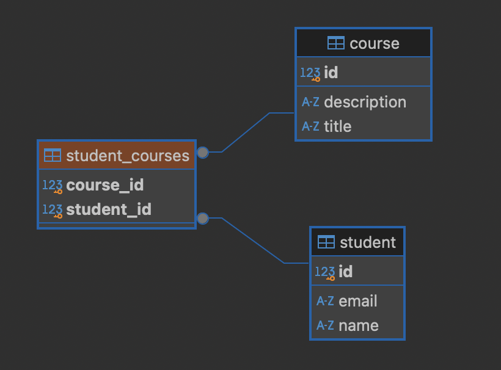

---

## 📁 File Structure

```commandline
enrollmate/
├── assets/                          # Custom folder for images, files, etc., used across the app
├── mvnw                             
├── mvnw.cmd                         
├── pom.xml                          
├── src/
│   ├── main/
│   │   ├── java/
│   │   │   └── com/
│   │   │       └── enrollmate/
│   │   │           ├── controller/              # Spring MVC controllers (handle HTTP requests)
│   │   │           │   ├── CourseController.java
│   │   │           │   └── StudentController.java
│   │   │           ├── dto/                     # Data Transfer Objects (DTOs for request/response shaping)
│   │   │           ├── model/                   # Entity classes (e.g., Student, Course)
│   │   │           │   ├── Course.java
│   │   │           │   └── Student.java
│   │   │           ├── repository/              # JPA repository interfaces
│   │   │           │   ├── CourseRepository.java
│   │   │           │   └── StudentRepository.java
│   │   │           ├── service/                 # Business logic layer
│   │   │           │   ├── CourseService.java
│   │   │           │   ├── StudentService.java
│   │   │           │   └── impl/                # Implementations of service interfaces
│   │   │           │       ├── CourseServiceImpl.java
│   │   │           │       └── StudentServiceImpl.java
│   │   │           ├── EnrollMateApplication.java  
│   │   │           └── ServletInitializer.java      
│   │   ├── resources/
│   │   │   ├── application.properties           
│   │   │   ├── data.sql                         # SQL script to populate initial data
│   │   │   ├── schema.sql                       
│   │   │   ├── static/                          # Static resources (CSS, JS, images)
│   │   │   │   └── style.css
│   │   │   └── templates/                       
│   │   └── webapp/
│   │       └── WEB-INF/
│   │           └── views/                       # JSP files (Java Server Pages for rendering views)
│   │               ├── student-list.jsp         # Displays list of students
│   │               ├── student-form.jsp         # Form to add/edit student details
│   │               ├── student-course-list.jsp  # Lists courses a student is enrolled in
│   │               ├── course-list.jsp          # Displays list of courses
│   │               ├── course-form.jsp          # Form to add/edit course details
│   │               └── course-student-list.jsp  # Lists students enrolled in a specific course
│   └── test/                                    
└── target/                                      

```

---

## 🚀 Features & Operations

> 💡 _For all the operations listed below, please refer to the screenshots in the [Testing](#-testing) section._

### 💾 Populate Database:
Sql script has be written to automatically populate demo data when the application is started.
```commandline
resources/
    - data.sql
    - schema.sql
```

### ✅ Create Operations
- **Add Student**: `/students/add`
- **Add Course**: `/courses/add`  
  _See visual demonstrations in the Testing section._

### 📄 Read Operations
- **List All Courses**: `/courses`
- **List Courses with Enrolled Students**: `/courses/with-students`
- **List All Students**: `/students`
- **List Students with Enrolled Courses**: `/students/with-courses`  
  _Screenshots are available in the Testing section._

### 🔁 Update Operations
- **Edit Course**: `/courses/edit/{id}`
- **Edit Student**: `/students/edit/{id}`  
  _Refer to the Testing section for before-and-after views._

---

## 🧪 Testing

### 📘 Courses

#### 🔹 List All Courses
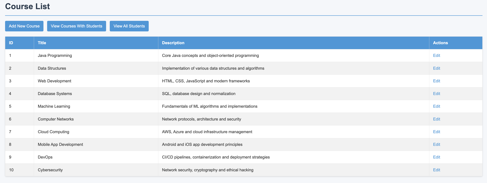

#### 🔹 View Courses with Enrolled Students
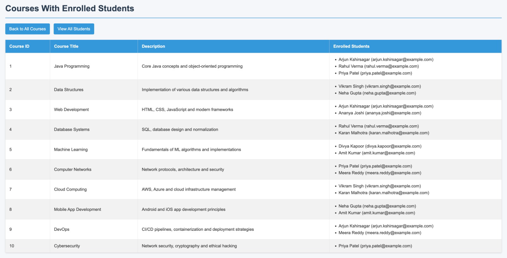

#### 🔹 Add a New Course
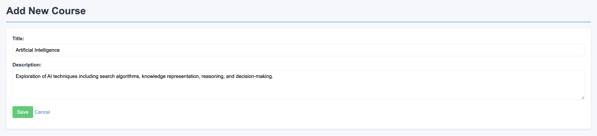  
✅ Course Added Successfully  


#### 🔹 Edit an Existing Course
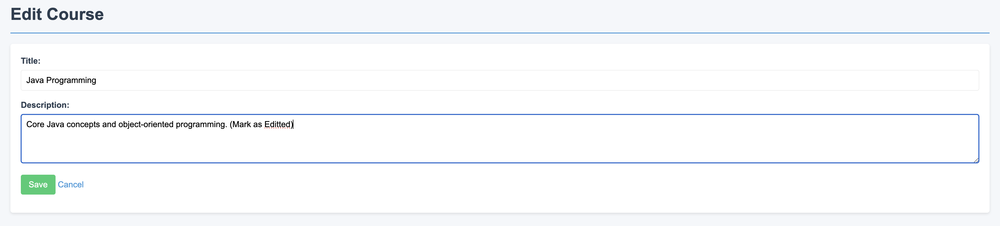  
✅ Course Edited Successfully  
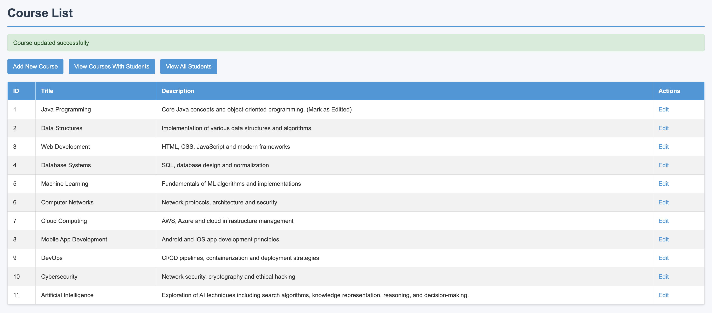

---

### 🎓 Students

#### 🔹 List All Students
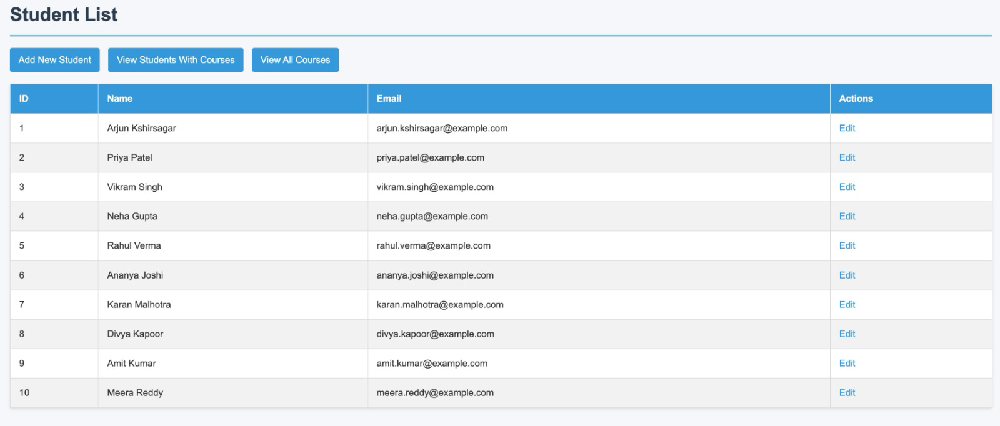

#### 🔹 View Students with Enrolled Courses
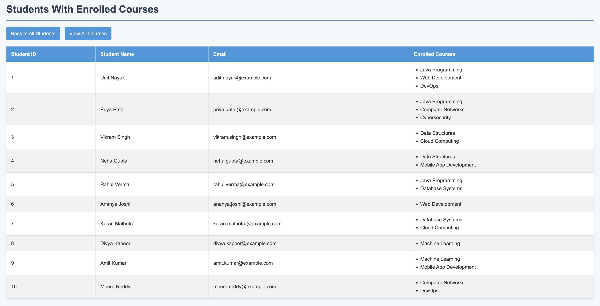

#### 🔹 Add a New Student
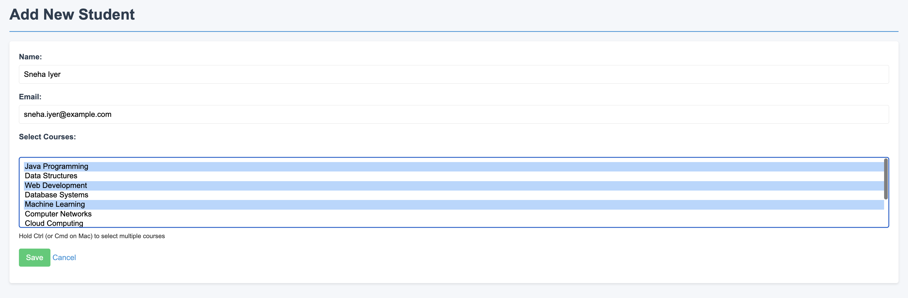  
✅ Student Added Successfully  
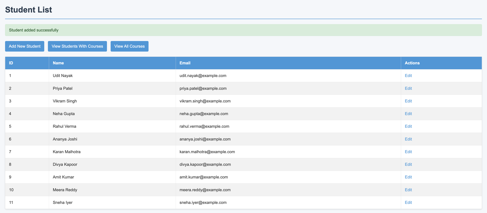

#### 🔹 Edit an Existing Student
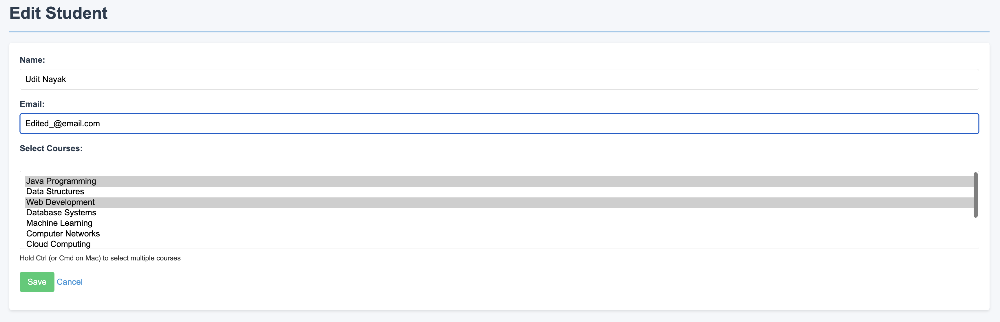  
✅ Student Edited Successfully  
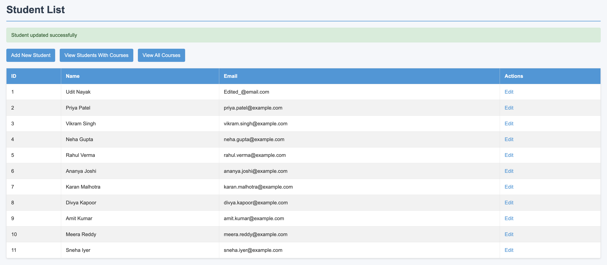

---

## ✅ Assignment Checklist

| Requirement                         | Status |
|--------------------------------------|--------|
| Two entities with relationship       | ✅     |
| Populate DB with sample data         | ✅     |
| Create operation via JSP form        | ✅     |
| Read operation with join view        | ✅     |
| Update operation for both entities   | ✅     |
| JPA annotations (`@Entity`, etc.)    | ✅     |
| Repository layer with custom query   | ✅     |
| Service layer for business logic     | ✅     |
| Unit tests for repository and service| ✅     |
| Controller layer with data binding   | ✅     |
| JSP views with basic styling         | ✅     |
| Manual testing of all operations     | ✅     |

> ✅ **All major features from the assignment have been successfully implemented.**
