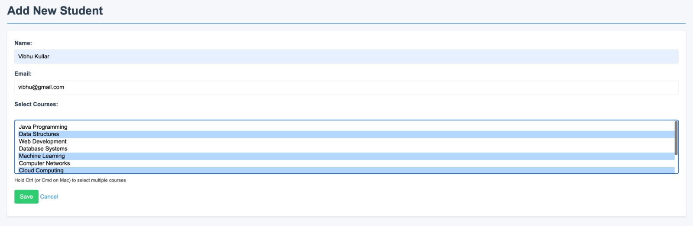

# Enroll Mate

**Enroll Mate** is a comprehensive Spring MVC web application that simplifies student-course enrollment management in academic institutions. It provides an intuitive user interface for administrators to manage academic records efficiently through complete CRUD operations.

---

### 🌟 Key Features

* **Student Management**: Add, view, edit, and manage student records
* **Course Management**: Create and organize academic courses
* **Enrollment System**: Track student-course relationships
* **Responsive UI**: Clean, intuitive interface with modern design
* **Data Visualization**: View relationships between students and courses

---

### 🚀 Getting Started

#### 🛠️ Prerequisites

* **Java 21** or higher
* **Apache Maven** 3.6.3 or later
* **IntelliJ IDEA** (recommended) or any Java IDE
* **MySQL** 8.0+ (or your preferred database)

#### 🏗️ Installation

1. Clone the repository:

   ```
   git clone git@github.com:arjun-kshirsagar/bits-sga-dbms.git
   cd bits-sga-dbms
   ```

2. Configure the database in `application.properties`:

   ```properties
   spring.datasource.url=jdbc:mysql://localhost:3306/enrolldb
   spring.datasource.username=your_username
   spring.datasource.password=your_password
   ```

3. Build and run the application:

   ```
   mvn clean install
   mvn spring-boot:run
   ```

4. Access the application at: `http://localhost:8080`

---

### 📊 Database Schema

The application uses a relational database with the following structure:


---

### 🏗️ Project Structure

```
bits-sga-dbms/
├── assets/                          
├── mvnw                             
├── mvnw.cmd                         
├── pom.xml                          
├── src/
│   ├── main/
│   │   ├── java/
│   │   │   └── com/
│   │   │       └── enrollmate/
│   │   │           ├── controller/              # Spring MVC controllers (handle HTTP requests)
│   │   │           │   ├── CourseController.java
│   │   │           │   └── StudentController.java
│   │   │           ├── dto/                     # Data Transfer Objects (DTOs for request/response shaping)
│   │   │           ├── model/                   # Entity classes (e.g., Student, Course)
│   │   │           │   ├── Course.java
│   │   │           │   └── Student.java
│   │   │           ├── repository/              # JPA repository interfaces
│   │   │           │   ├── CourseRepository.java
│   │   │           │   └── StudentRepository.java
│   │   │           ├── service/                 # Business logic layer
│   │   │           │   ├── CourseService.java
│   │   │           │   ├── StudentService.java
│   │   │           │   └── impl/                # Implementations of service interfaces
│   │   │           │       ├── CourseServiceImpl.java
│   │   │           │       └── StudentServiceImpl.java
│   │   │           ├── EnrollMateApplication.java  
│   │   │           └── ServletInitializer.java      
│   │   ├── resources/
│   │   │   ├── application.properties           
│   │   │   ├── data.sql                         # SQL script to populate initial data
│   │   │   ├── schema.sql                       
│   │   │   ├── static/                          # Static resources (CSS, JS, images)
│   │   │   │   └── style.css
│   │   │   └── templates/                       
│   │   └── webapp/
│   │       └── WEB-INF/
│   │           └── views/                       # JSP files (Java Server Pages for rendering views)
│   │               ├── student-list.jsp         # Displays list of students
│   │               ├── student-form.jsp         # Form to add/edit student details
│   │               ├── student-course-list.jsp  # Lists courses a student is enrolled in
│   │               ├── course-list.jsp          # Displays list of courses
│   │               ├── course-form.jsp          # Form to add/edit course details
│   │               └── course-student-list.jsp  # Lists students enrolled in a specific course
│   └── test/                                    
└── target/                                      

```

---

### 🧾 Features & Operations

#### Student Management

### 💾 Populate Database:
Sql script has be written to automatically populate demo data when the application is started.
```commandline
resources/
    - data.sql
    - schema.sql
```

#### Course Management

### 📄 Read Operations
- **List All Courses**: `/courses`
- **List Courses with Enrolled Students**: `/courses/with-students`
- **List All Students**: `/students`
- **List Students with Enrolled Courses**: `/students/with-courses`  
  _Screenshots are available in the Testing section._

#### Sample Data

Initial test data is automatically loaded from `data.sql` on application startup.


## 🧪 Testing

### 📘 Courses

#### 🔹 List All Courses


#### 🔹 View Courses with Enrolled Students


#### 🔹 Add a New Course
  
✅ Course Added Successfully  


#### 🔹 Edit an Existing Course
  
✅ Course Edited Successfully  


---

### 🎓 Students

#### 🔹 List All Students


#### 🔹 View Students with Enrolled Courses


#### 🔹 Add a New Student
  
✅ Student Added Successfully  


#### 🔹 Edit an Existing Student
  
✅ Student Edited Successfully  


---

## ✅ Assignment Checklist

| Requirement                         | Status |
|--------------------------------------|--------|
| Two entities with relationship       | ✅     |
| Populate DB with sample data         | ✅     |
| Create operation via JSP form        | ✅     |
| Read operation with join view        | ✅     |
| Update operation for both entities   | ✅     |
| JPA annotations (`@Entity`, etc.)    | ✅     |
| Repository layer with custom query   | ✅     |
| Service layer for business logic     | ✅     |
| Unit tests for repository and service| ✅     |
| Controller layer with data binding   | ✅     |
| JSP views with basic styling         | ✅     |
| Manual testing of all operations     | ✅     |

> ✅ **All major features from the assignment have been successfully implemented.**

---

### 🙏 Acknowledgments

* Built with Spring Boot and Thymeleaf
* Bootstrap for responsive design
* Icons by [Font Awesome](https://fontawesome.com)